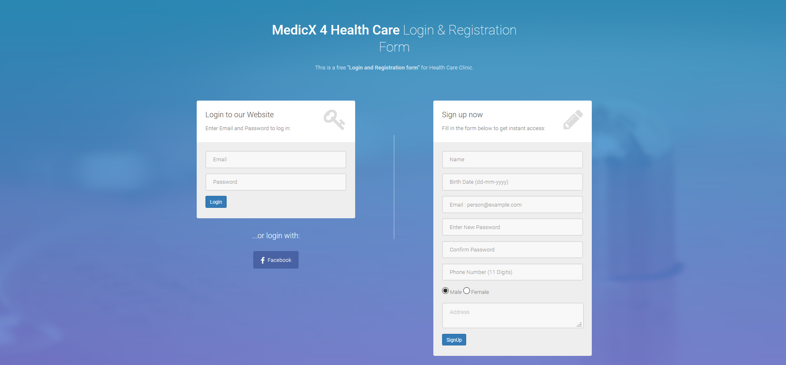
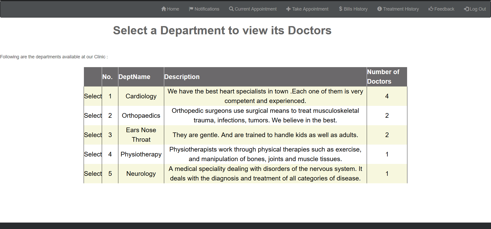
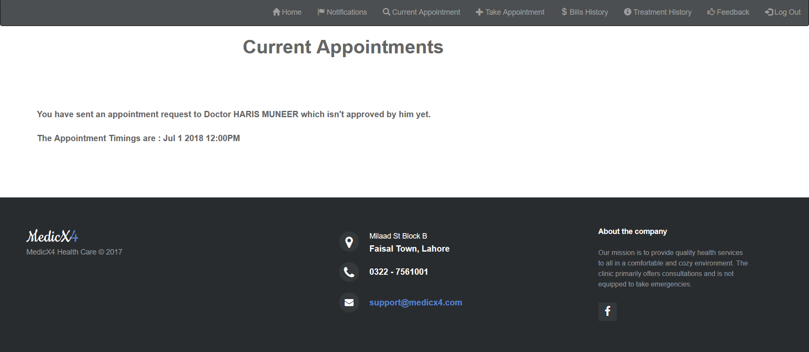
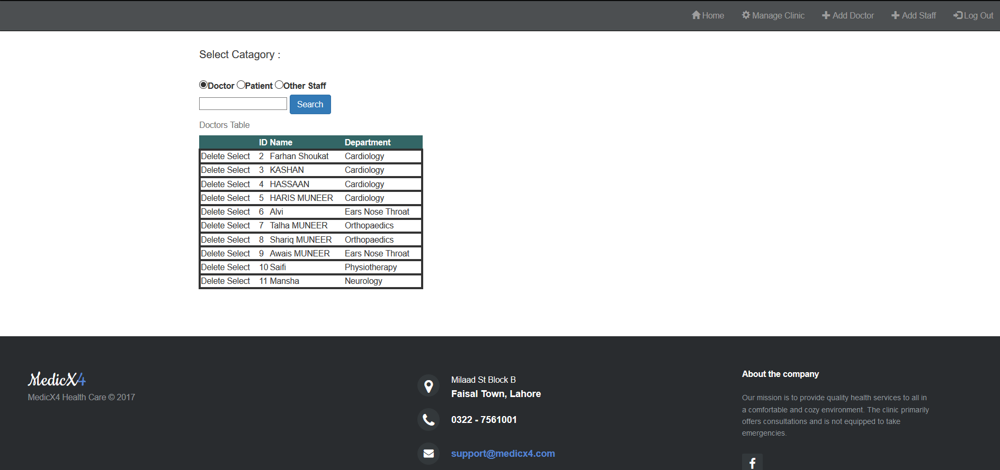
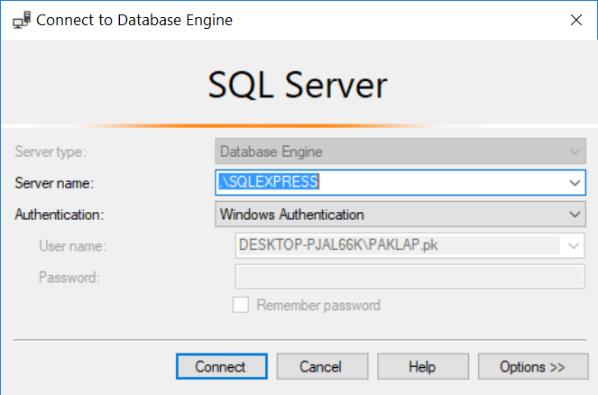
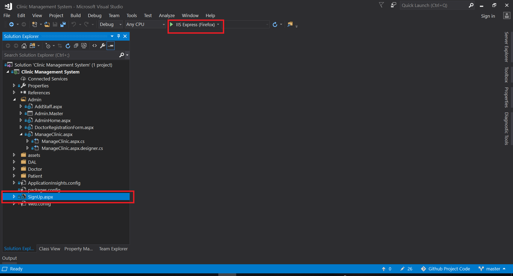

# ⚕️ Système de gestion hospitalière - Réalisé avec C#, `ASP.net Core`

Un système de gestion de clinique entièrement équipé avec une base de données bien conçue créée en tant que projet final pour le module "Développement d'applications avec ASP.NET CORE" au cours de mon semestre à l'[EMSI](https://emsi.ma/).

### Page d'inscription



### Prendre un rendez-vous



### Rendez-vous actuels



### Rechercher du personnel



### 1. Patient :

- **1. Accueil du patient** - Le patient peut consulter son profil.
- **2. Rendez-vous actuel** - Le patient peut voir s'il a des rendez-vous en attente ou approuvés avec un médecin.
- **3. Historique des factures** - Le patient peut consulter l'historique des factures des rendez-vous terminés.
- **4. Historique des traitements** - Le patient peut consulter l'historique des traitements des rendez-vous terminés.
- **5. Prendre un rendez-vous** - Le patient peut voir tous les départements, puis peut en sélectionner un. Ensuite, les médecins de ce département sont affichés. Ensuite, le patient sélectionne un médecin et le profil du médecin est affiché avec un bouton "prendre un rendez-vous". Lorsque le bouton est cliqué, les créneaux horaires disponibles pour ce médecin particulier sont affichés. Le patient sélectionne un créneau horaire de son choix et envoie une demande pour ce créneau au médecin. Le médecin l'approuvera ou le rejettera.
- **6. Notifications** - Dans cet onglet, une notification est affichée chaque fois que le médecin accepte ou rejette la demande de rendez-vous.
- **7. Feedback** - Après un rendez-vous, le patient peut donner son avis en le notant de 1 à 5.
- **8.** Un patient peut demander un seul rendez-vous à la fois et ne sera pas autorisé à prendre plus d'un rendez-vous tant que le dernier rendez-vous n'a pas été terminé.

### 2. Médecin :

- **1. Profil du médecin** : Le médecin peut consulter son propre profil.
- **2. Rendez-vous en attente** : Le médecin peut voir tous les rendez-vous en attente pour son identifiant de médecin.
- **3. Rendez-vous du jour** : Les rendez-vous pour la journée en cours seront affichés. Le médecin peut ensuite sélectionner/rejeter tout rendez-vous de ce jour.
- **4. Mise à jour de l'historique** : Il peut mettre à jour l'ordonnance, la maladie et l'évolution du patient.
- **5. Générer une facture** : Il générera ensuite la facture.
- **6. Historique du patient** : Le médecin pourra voir l'historique des traitements de tous ses patients traités.

### 3. Administrateur :

- **1. Accueil de l'administrateur** : L'administrateur peut voir les statistiques de la clinique, y compris les rendez-vous hebdomadaires, les revenus de la clinique, le nombre de patients et de médecins inscrits, ainsi que la liste des départements.
- **2. Voir les médecins** : L'administrateur peut voir la liste des médecins actuellement inscrits avec leurs départements et d'autres informations. Le profil complet sera affiché en cliquant.
- **3. Voir les patients** : L'administrateur peut voir la liste des patients actuellement inscrits avec leurs numéros de téléphone et leurs identifiants. Le profil complet sera affiché en cliquant.
- **4. Voir le personnel** : L'administrateur peut voir les autres membres du personnel avec leurs désignations.
- **5. Boîte de recherche** : L'administrateur peut rechercher un employé spécifique dans l'entreprise par nom.
- **6. Ajouter/Supprimer** : L'administrateur peut ajouter/supprimer des médecins, des patients et d'autres membres du personnel de la clinique.

## Comment exécuter

1- Installez les éléments suivants :

- [Microsoft Visual Studio](https://visualstudio.microsoft.com/vs/community/)
- [Microsoft SQL Server Express](https://www.microsoft.com/en-us/sql-server/sql-server-editions-express)
- [Microsoft SQL Server Management Studio (SSMS)](https://docs.microsoft.com/en-us/sql/ssms/download-sql-server-management-studio-ssms?view=sql-server-2017)

2- Ouvrez SQL Server Management Studio et dans la fenêtre "Se connecter au moteur de base de données", tapez ce qui suit :

```
Nom du serveur : .\SQLEXRPESS
Authentification : Authentification Windows
```

<p align="center">
 
</p>

3- Maintenant, ouvrez le fichier Schema.sql dans le dossier Database Files et exécutez-le. Cela créera la base de données et les tables. Ensuite, exécutez les fichiers SQL suivants : Admin.sql, Doctor.sql, Patient.sql, Signup.sql.

4- Exécutez maintenant le fichier Insertions.sql dans le dossier Database Files. Cela remplira la base de données avec quelques entrées de test. De plus, quelques e-mails et mots de passe de connexion de médecins, patients et administrateurs sont placés dans le fichier Insertions.sql. Vous pouvez les utiliser pour tester les fonctionnalités du système.

5- Tout est configuré maintenant ! Vous pouvez exécuter le projet Visual Studio en ouvrant Clinic Management System.sln, puis en sélectionnant la page SignUp.aspx et en cliquant sur le bouton Exécuter nommé IIS Express.

<p align="center">
 
</p>
